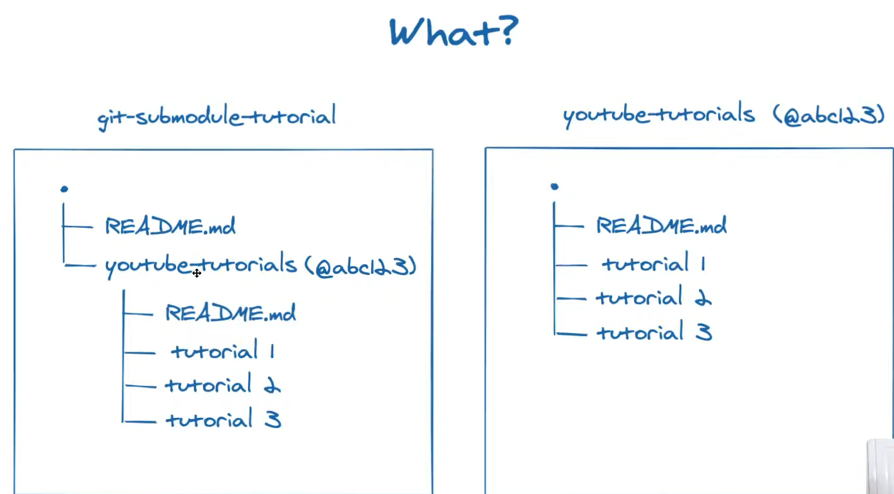

# Using external libraries with Cmake

This practice is to show
- how to write a CMakeLists.txt when we use an external library
- how to integrate external libraries with git

## Build a library from source code

## Integrate with git: using submodule
### why git submodule
It is so often that our external libraries come from git repositories. Their verisons are always controllerd under git.

We use submodule when a git project, an external library developed by others, is used in a main git project, our project. For instance, we want to use project youtube-tutorials in git-submodule-turorial.

Here are some expectations from us
- Each person is in charge of his own work. We do not want to develop or maintain his codes. We just use it without **looking inside**.
- We can control our library version in spite of his update. They keep working and improving their codes by adding new feutures and fixing bugs. But, we may not need those updates at all. Even worse, those updates could break our codes if they changed some access. Thus, **we should be able to control the library version**.
- We only take our own credits. If someone finds our codes interesting and try to git clone, with submodule he can find the library and the version at the original address. **It means that credits go to the library developers and we do not steal it**.

### submodule example
For example, there is a folder called as *external* that we create for external libraries. Now, we want to use a library Fastor that is a high performance tensor (fixed multi-dimensional array) library for modern C++.

-----root 
&emsp;|  
&emsp;|--- CMakeLists.txt  
&emsp;|  
&emsp;|--- main.cpp 
&emsp;| 
&emsp;|--- function 
&emsp;|&emsp;&emsp;&emsp;&emsp;&emsp;|---- function1.cpp 
&emsp;|&emsp;&emsp;&emsp;&emsp;&emsp;|---- function1.hpp 
&emsp;|&emsp;&emsp;&emsp;&emsp;&emsp;|---- CMakeLists.txt 
&emsp;| 
&emsp;|--- external 

There is how we use git commands to add an external library.
1. 

# Source
1. Youtube, Git Tutorial: All About Submodules, [link](https://www.youtube.com/watch?v=8Z4Cmhji_FQ&ab_channel=GitKraken).