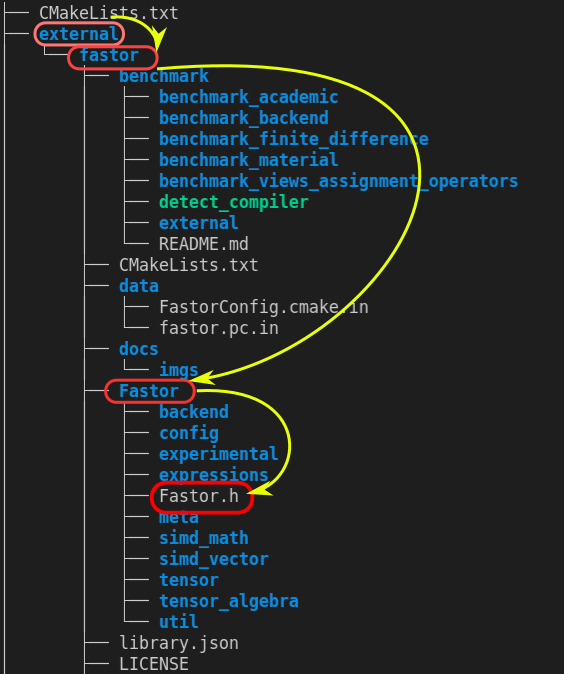

# Using external libraries with Cmake

This practice is to show
- how to write a CMakeLists.txt when we use an external library
- how to integrate external libraries with git


## Integrate with git: using submodule
### why git submodule
It is so often that our external libraries come from git repositories. Their verisons are always controllerd under git.

We use submodule when a git project, an external library developed by others, is used in a main git project, our project. For instance, we want to use project youtube-tutorials in git-submodule-turorial.


Here are some expectations from us
- Each person is in charge of his own work. We do not want to develop or maintain his codes. We just use it **without looking inside**.
- We can control our library version in spite of his update. They keep working and improving their codes by adding new feutures and fixing bugs. But, we may not need those updates at all. Even worse, those updates could break our codes if they changed some access. Thus, **we should be able to control the library version**.
- We only take our own credits. If someone finds our codes interesting and try to git clone, with submodule he can find the library and the version at the original address. **It means that credits go to the library developers and we do not steal them**.

### Submodule example
For example, there is a folder called as *external* that we create for external libraries. Now, we want to use a library Fastor that is a high performance tensor (fixed multi-dimensional array) library for modern C++.

-----root<br/>
&emsp;| <br/>
&emsp;|--- CMakeLists.txt <br/>
&emsp;| <br/>
&emsp;|--- main.cpp<br/>
&emsp;|<br/>
&emsp;|--- function<br/>
&emsp;|&emsp;&emsp;&emsp;&emsp;&emsp;|---- function1.cpp<br/>
&emsp;|&emsp;&emsp;&emsp;&emsp;&emsp;|---- function1.hpp<br/>
&emsp;|&emsp;&emsp;&emsp;&emsp;&emsp;|---- CMakeLists.txt<br/>
&emsp;|<br/>
&emsp;|--- external<br/>

There is how we use git commands to add an external library.

We download the library codes into /external/fastor
```
git submodule add https://github.com/romeric/Fastor.git external/fastor 
```
-----root<br/>
&emsp;| <br/>
&emsp;|--- CMakeLists.txt <br/>
&emsp;| <br/>
&emsp;|--- main.cpp<br/>
&emsp;|<br/>
&emsp;|--- function<br/>
&emsp;|&emsp;&emsp;&emsp;&emsp;&emsp;|---- function1.cpp<br/>
&emsp;|&emsp;&emsp;&emsp;&emsp;&emsp;|---- function1.hpp<br/>
&emsp;|&emsp;&emsp;&emsp;&emsp;&emsp;|---- CMakeLists.txt<br/>
&emsp;|<br/>
&emsp;|--- external<br/>
&emsp;|&emsp;&emsp;&emsp;&emsp;&emsp;|---- fastor<br/>

## Build a library from source code
Obvisouly, what we download from github is just source codes. We need to build the fastor library using its source code before we call use this library.

Let me remind you here. To call a library in our main fucntion requires three important information
1. A well built library,
2. Cmake can link our main executable to the library .a or .so,
3. Cmake locates the header files and use this relative location in the main.cpp.


The first requirement depends on how the library is designed to be built. For instance, our desired library fastor is one buit using cmake as well. We can find the CMakeLists.txt in the *external/fastor* folder.

Thus, we just have to add the fastor library to our CMakeLists tree by addings
 ```
# add directory of external library
add_subdirectory(external/fastor) 
```
Since the fastor CMakeLists.txt builds the library automatically, swe only need to tell our Cmake "hi, chck this folder and you can find a CMakeLists.txt. Then do what it reads."

Then,
 ```
cd build

cmake ..

make
```

## Locate and use the external library in CMakeLists.txt and main.cpp
Now we give a shoot to address the left two questions:
-  Cmake can link our main executable to the library .a or .so
-  Cmake locates the header files and use this relative location in the main.cpp


**NOTE**
It is so essential to check the library CMakiLists.txt to see
- if it is built as a **library**
- what is the library **name** 

We are lucky to find in the CMakiLists.txt that
 ```
add_library(Fastor INTERFACE)
```
which means the library is built as a **library** named after **Fastor**.

Therefore, in the main CMakeLists.txt, we tell the Cmake to link the library
 ```
target_link_libraries(out Fastor)
```

OK, now comes the most tricky part of this exercise. First of all, we library target does not include its location information as we did in the 2MultiFiles_2. As a consequence, we still know nothing of its location when we link the library to our main target using *target_link_libraries(out Fastor)*.

In order to allow our main executable file to find the library, we can manually add the library location information to our main target
 ```
# locate hpp files of external library
target_include_directories(out PUBLIC external/fastor)
 ```
 

The full path of Fastor.h to main CMakeLists is *external/fastor/Fastor/Fastor.h*. Since we define the include path in the CMakeLists as *external/fastor*, the relative path of *Fastor.h* w.r.t main.cpp is *Fastor/Fastor.h*
 ```
#include "Fastor/Fastor.h"
 ```

Let us test our thoughts one more time.

Knowning the full path is *external/fastor/Fastor/Fastor.h*, if we define the include path in our main CMakeLists as
```
target_include_directories(out PUBLIC external)
```
then, the relative path in our main.cpp must be
```
#include "fastor/Fastor/Fastor.h"
```
 


# Source
1. GitKraken, *Git Tutorial: All About Submodules*, Youtube, [link](https://www.youtube.com/watch?v=8Z4Cmhji_FQ&ab_channel=GitKraken).
2. Code, Tech, and Tutorials, *CMake Tutorial EP 3 | Git Submodules (adding glfw windowing library example)*, Youtbe, [link](https://www.youtube.com/watch?v=ED-WUk440qc&list=PLalVdRk2RC6o5GHu618ARWh0VO0bFlif4&index=3&ab_channel=Code%2CTech%2CandTutorials).
